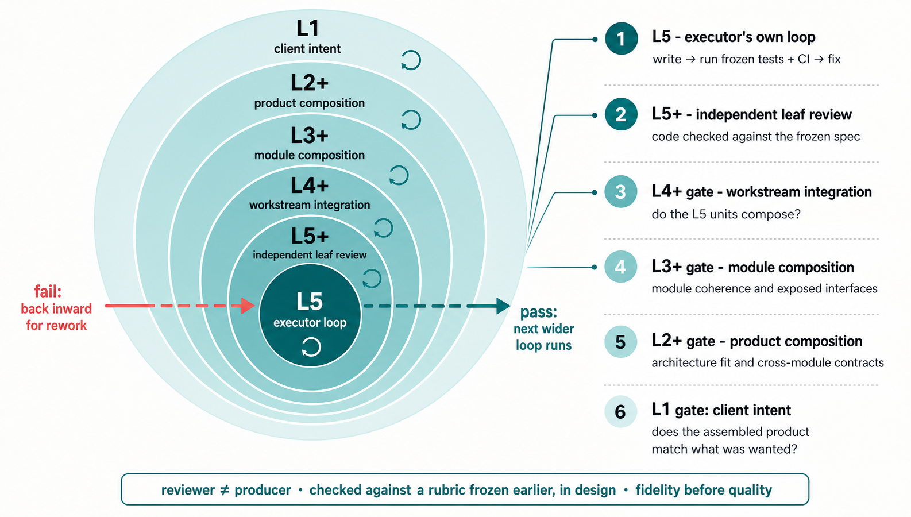

# Software Factory

A software factory: a hierarchy of LLM agents that turns a person's intent into built,
verified software, and a research system that watches the factory run and improves it.

Models already write good code, so the bottleneck in building software with them has shifted
from execution to coordination and fidelity: directing many efforts in parallel, and keeping
what gets built faithful to what was meant. One person can run one project by hand; they
cannot direct, keep coherent, and quality-check twenty at once, nor guarantee that a long
autonomous build still matches what they asked for.

This repository holds two systems built against that problem:

- **`factory/`** — the L1–L5 build hierarchy: five levels of agents, each doing a genuinely
  different kind of thinking, joined by a hard gate between designing and building.
- **`research-system/`** — the Hypothesis Tree Research System: an autonomous research loop
  whose subject is the factory itself. It proposes changes to the factory, runs them under a
  verifier that adjudicates every claim, and merges what survives.

They live together because the second one's subject is the first one. Where the research
system names L1–L5 seats or looks for the factory's audit logs, it is talking about the
directory next to it. In the factory's internal docs, “the harness” means the factory
runtime; in the research system, `HT_ROLE=harness` names a tool-authored field. These are
unrelated uses.

---

## The factory

### The five levels

A separation by the kind of thinking each does, not a rank ladder:

- **L1 — System Orchestrator** — captures the user's intent, guards it for the life of the
  project, routes work, and is the only level the user talks to.
- **L2 — Project Architect** — designs the shape of the solution: where the module
  boundaries fall, the interfaces between them, the decisions that are expensive to reverse.
- **L3 — Module Designer** — takes one module and designs it in depth, then manages its
  construction. For a substantial module these are two separate instances: a planning instance
  produces the design and ends; after the plan-alignment gate passes, a fresh execution instance
  takes the frozen design, splits it into workstreams, and runs them.
- **L4 — Workstream Coordinator** — breaks a module into concrete tasks and owns the path
  that turns frozen criteria into the pre-written acceptance tests they'll be judged against.
- **L5 — Task Executor** — writes the actual code against frozen tests, paired with an
  independent reviewer (L5+) that checks it.

Direction flows down as minimal "short-email" briefs (what, not how); results flow up as
compressed reports. Raw work never moves up, and clean context is preserved at every
boundary.

### How a build runs

Work runs as two cycles joined by a single hard gate — design, then build — never one big
waterfall.

The **design cycle** produces a validated plan and not a line of code. Intake turns the
user's intent into a precise, tagged, traceable spec. The architect proposes the structure.
The module designers detail each area in a single coordinated round, renegotiating interfaces
against real constraints. And — critically — the falsifiable acceptance criteria and review
rubrics are written here, before any code, by agents that aren't the ones who'll do the work.

The **plan-alignment gate** is the heart of the factory, at the seam between designing and
building. It reads the whole assembled plan against the original intent — something
per-level reviews structurally can't do — and catches the three ways a plan drifts even when
every local step looked fine: dropped requirements, unrequested additions, and requirements
technically present but subtly wrong. It even inspects its own first translation (turning
the user's prose into requirements), because that's where drift enters upstream of every
other check. It elevates only findings that need owner judgment; nothing builds until the gate
passes.

The **build cycle** begins only on PASS: executors write code against the now-frozen plan,
every level's output checked by independent review before it moves up.

### View

The diagram below is a simplified view of the factory's full two-cycle model. The current implementation
authors executable acceptance just in time during the build cycle and asks for owner judgment only
on findings elevated by the plan-alignment gate, rather than requiring a full human review on every
pass.

```text
════════════════════ DESIGN CYCLE - plan pyramid, no code ════════════════════

                     ┌──────────────────────────┐
                     │           USER           │ ---> User gives task and sets scope
                     └────────────┬─────────────┘
                                  ▲
                                  │ up: L1 gate, product vs intent
                                  │
                                  │ down: deep interview elicits intent
                                  ▼
                     ┌────────────┴─────────────┐
                     │ L1 - System Orchestrator │
                     │ elicit + guard + route   │
                     └────────────┬─────────────┘
                                  ▼
                     ┌──────────────────────────┐
                     │ tagged intent contract   │
                     │ atoms + success criteria │
                     └────────────┬─────────────┘
                                  ▼
                       ┌────────────────┐
                       │ L2 - Architect │
                       │ plan/contracts │
                       └────────┬───────┘
             ┌──────────────────┼──────────────────┐
             ▼                  ▼                  ▼
        ┌─────────┐        ┌─────────┐        ┌─────────┐
        │ L3[1]   │  ...   │ L3[i]   │  ...   │ L3[n]   │
        │ design  │        │ design  │        │ design  │
        └─────────┘        └────┬────┘        └─────────┘
                                │ selected plan slice
                                ▼
┌──────────────────────────── L3[i] design slice ───────────────────────────┐
│                                                                           │
│              ┌────────────────┼────────────────┐                          │
│              ▼                ▼                ▼                          │
│         ┌─────────┐      ┌─────────┐      ┌─────────┐                     │
│         │ spec    │      │ contract│      │ ADRs    │                     │
│         │ atoms   │      │ edges   │      │ + risks │                     │
│         └─────────┘      └─────────┘      └─────────┘                     │
│                                                                           │
│              ┌────────────────┼────────────────┐                          │
│              ▼                ▼                ▼                          │
│         ┌─────────┐      ┌─────────┐      ┌─────────┐                     │
│         │ L4 test │ ...  │ L4 test │ ...  │ L4 test │                     │
│         │ [i,1]   │      │ [i,j]   │      │ [i,m]   │                     │
│         └────┬────┘      └────┬────┘      └────┬────┘                     │
│              └────────────────┼────────────────┘                          │
│                               ▼                                           │
│                     ┌──────────────────┐                                  │
│                     │ frozen rubrics   │                                  │
│                     │ + wiring spike   │                                  │
│                     └────────┬─────────┘                                  │
│                              ▼                                            │
│                    validated plan, not code                               │
└───────────────────────────────┬───────────────────────────────────────────┘
                                ▼
                       ┌────────────────┐
                       │ L2 integrates  │
                       │ whole plan     │
                       └────────┬───────┘
                                ▼

        ┌────────────┬────────────┬────────────┐
        │ intent map │ coverage   │ ID atoms   │
        ├────────────┼────────────┼────────────┤
        │ blind read │ adversary  │ human sign │
        └─────┬──────┴─────┬──────┴─────┬──────┘
              └────────────┼────────────┘
                           ▼
                  ┌─────────────────────┐
                  │ PLAN-ALIGNMENT GATE │
                  │ one hard checkpoint │
                  └──────────┬──────────┘
                             ▼ PASS
                    unlock execution build

════════════════ BUILD CYCLE - execution pyramid slice ═══════════════════════

                     ┌──────────────────────────┐
                     │ L1 - System Orchestrator │
                     └────────────┬─────────────┘
                                  ▼
                       ┌────────────────┐
                       │ L2 - Architect │
                       └────────┬───────┘
             ┌──────────────────┼──────────────────┐
             ▼                  ▼                  ▼
        ┌─────────┐        ┌─────────┐        ┌─────────┐
        │ L3[1]   │  ...   │ L3[i]   │  ...   │ L3[n]   │
        └─────────┘        └────┬────┘        └─────────┘
                                │ selected slice
                                ▼
┌────────────────────────────── L3[i] area ─────────────────────────────────┐
│                                                                           │
│              ┌────────────────┼────────────────┐                          │
│              ▼                ▼                ▼                          │
│         ┌─────────┐      ┌─────────┐      ┌─────────┐                     │
│         │ L4[i,1] │ ...  │ L4[i,j] │ ...  │ L4[i,m] │                     │
│         └─────────┘      └────┬────┘      └─────────┘                     │
│                               │ selected workstream                       │
│                               ▼                                           │
│   ┌──────────────────────── L4[i,j] workstream ──────────────────────┐    │
│   │                                                                  │    │
│   │        ┌──────────┐      ┌──────────┐      ┌──────────┐          │    │
│   │        │L5[i,j,1] │ ...  │L5[i,j,k] │ ...  │L5[i,j,p] │          │    │
│   │        └────┬─────┘      └────┬─────┘      └────┬─────┘          │    │
│   │             ▼                 ▼                 ▼                │    │
│   │        ┌──────────┐      ┌──────────┐      ┌──────────┐          │    │
│   │        │L5+[i,j,1]│ ...  │L5+[i,j,k]│ ...  │L5+[i,j,p]│          │    │
│   │        └────┬─────┘      └────┬─────┘      └────┬─────┘          │    │
│   │             │ accepted leaves │                 │                │    │
│   │             └─────────────────┼─────────────────┘                │    │
│   │                               ▼                                  │    │
│   │                  all L5[i,j,1..p] accepted                       │    │
│   │                               ▼                                  │    │
│   │                     ┌──────────────────┐                         │    │
│   │                     │ L4[i,j] decides  │                         │    │
│   │                     │ integrate+submit │                         │    │
│   │                     └────────┬─────────┘                         │    │
│   │                              ▼ submit                            │    │
│   │                     ┌──────────────────┐                         │    │
│   │              reject │   L4+[i,j] gate  │                         │    │
│   │        ┌────────────┤ workstream review│                         │    │
│   │        │            └────────┬─────────┘                         │    │
│   │        │                     ▼ accept                            │    │
│   │        └──── back to L4[i,j]; may fan down again                 │    │
│   └──────────────────────────────┼───────────────────────────────────┘    │
│                                  ▼                                        │
│                 L3[i] receives accepted L4[i,j] package                   │
│                 after all L4[i,1..m] packages pass                        │
│                                  ▼                                        │
│                         ┌──────────────────┐                              │
│                         │ L3[i] decides    │                              │
│                         │ integrate+submit │                              │
│                         └────────┬─────────┘                              │
│                                  ▼ submit                                 │
│                         ┌──────────────────┐                              │
│                  reject │    L3+[i] gate   │                              │
│            ┌────────────┤ area review      │                              │
│            │            └────────┬─────────┘                              │
│            │                     ▼ accept                                 │
│            └──── back to L3[i]; may fan down again                        │
└──────────────────────────────────┼────────────────────────────────────────┘
                                   ▼
                  L2 receives accepted L3[i] area
                  after all L3[1..n] areas pass
                                   ▼
                          ┌──────────────────┐
                          │ L2 decides       │
                          │ integrate+submit │
                          └────────┬─────────┘
                                   ▼ submit
                          ┌──────────────────┐
                   reject │      L2+ gate    │
             ┌────────────┤ system review    │
             │            └────────┬─────────┘
             │                     ▼ accept
             │            ┌──────────────────┐
             │            │ L1 final report  │
             │            └────────┬─────────┘
             │                     ▼ submit
             │            ┌──────────────────┐
             │     reject │     L1 gate      │ accept
             │   ┌────────┤ user vs intent   ├────> USER
             │   │        └──────────────────┘
             │   └── back to L1; may fan down again
             └──── back to L2; may fan down again

Index key:
  L3[i]       one selected L3 area inside L3[1..n]
  L4[i,j]     one selected L4 workstream inside L3[i,1..m]
  L5[i,j,k]   one selected L5 task inside L4[i,j,1..p]
  n/m/p       variable child counts; each parent may have a different count
  L5+         reviews one L5 leaf; L4+/L3+/L2+ review completed packages
  L1          has no plus: the user judges the final product against intent

Loop rule:
  A gate rejects to its owning producer. The producer keeps context, repairs,
  and may cascade work back down before submitting to the same gate again.

──────────────────────────────────────────────────────────────────────────────
ONE SPINE - requirement-ID = agent address = workspace = git branch =
rubric file = read-visibility. Decided once; everything keys off it.

```

### What makes it distinctive

Each level repeats the same plan / execute / review shape: going down, it turns its artifact into a
more detailed spec and fixed criteria; coming up, a separate gate checks the lower level's work
against those criteria. The L1–L2 relationship therefore has the same shape as L4–L5, even though
each gate reviews at a different altitude.



*The factory's nested review loops. Passing work moves outward to the next gate; a rejection
returns to the owning producer, which may cascade repairs inward.*

- **Tests before code, by not-the-coder.** Tests written after the fact get bent to fit the
  code; written first, from the spec, by someone else, the code must serve them. Tests
  anchor only what they assert, so an independent reviewer stays load-bearing alongside
  them, catching the fidelity gaps tests miss. In one simulated run an executor passed all
  17 tests while taking a value from the wrong source; the tests did not assert the source,
  and only the independent reviewer caught it.
- **One spine.** A single hierarchical scheme is the requirement ID, the agent's address,
  the workspace path, the git branch, the rubric location, and the visibility graph —
  decided once, it serves all of them.
- **Automated decomposition by method, not by taste.** Splitting a project into modules,
  workstreams, and tasks follows an explicit method: C4 altitudes (system → container →
  component), DDD seam-finding (cut where the language shifts and things change together),
  a spec-driven (SDD) chain that ties a requirement ID from intent down to code, and
  hexagonal ports for the interfaces. Ousterhout's “deep modules” checks a carving; it does
  not generate one.
- **Cross-model by design.** Generative and architectural levels and the literal, precise
  execution level run on different models. Failures escalate rather than silently degrade.
- **Documentation is memory.** Every level can be killed and respawned from its artifacts;
  truth lives in documents, coordinated over a lightweight bus.
- **Walking-skeleton first.** A thin end-to-end thread proves the connections before the
  full build commits to them.

The methodology is borrowed from how architecture firms and consultancies turn a client's
intent into a built thing; the factory staffs that organization with agents in every seat.

---

## The research system

A factory that improves itself needs somewhere to put what it learns, and something that
refuses to accept a claim just because an agent made it. `research-system/` is the factory's
research wing.

Its control plane is a **hypothesis tree**: nodes are variants of the factory, or premises
about why an intervention should work, growing more specific with depth. Verified child
outcomes propagate standing upward, so a parent node stays a truthful compressed summary of
everything proven beneath it.

Three roles run the loop, deliberately separated by what they are allowed to write:

- A **director** sees only compressed state — the tree, the ledger, computed statistics,
  selected digests — and chooses which single leaf to explore next. It controls navigation
  but may not author the evidence it steers by.
- A **research unit** (senior, junior, checker) executes one bounded dispatch on its own
  branch and returns one report.
- A **verifier** adjudicates every claim before it enters durable state — approve, demote,
  or reject — and is the only writer of the tree's and the ledger's epistemic content.

The failure modes it exists to prevent are the ones that make self-improving agent systems
quietly useless: claim inflation, evidence that gets lost in the write-up, path-dependent
navigation, amnesia between sessions, drift onto the wrong task, and stopping too early.

Around that loop sit the instruments: a **trace reader** that turns raw agent session
transcripts into structured behavioral records, an **observatory** that screens real runs
for behavioral symptoms against a versioned spine of expectations, and a **composition
gate** that decides whether a branch's work composes. State mutation goes through one write
gate — the `ht` CLI — so that the system's invariants live in machinery rather than in
instructions an agent might skip.

---

## Repository map

```text
factory/
  design/         the specification corpus: architecture and design principles, the runtime
                  cluster specs (daemon, watchdog, transports, scale), and the mechanism
                  specs — plan-alignment gate, gate lifecycle, decomposition methodology,
                  quality gate, observability, communication, workspace schema, security,
                  intake-to-delivery. design/INDEX.md is the governing map.
  operational/    what each agent loads at spawn: L1–L5 and the review seats (role, config,
                  soul, spawn-template), the plan-alignment and review-check surfaces, and
                  shared protocols (lifecycle, comms, git, intent-spec contract, runtime and
                  model map, agent-definition principles, review handbook).
  harnessd/       the runtime: a run-scoped daemon that spawns and supervises the live
                  cascade in tmux — spawn chokepoint with per-runtime adapters, liveness
                  watchdog, return-contract walker, promote/intake gate, WAL-backed state.
  tools/          instruments: doc-block rendering, per-level evaluation harnesses, launch
                  surface audits.
  tests/          the factory's test suite.
  dry-run/        the worked example: an intent spec taken through L2 (ADRs, contracts,
                  frozen interfaces, area plan), a walking skeleton, the plan-alignment gate
                  report, and a built payments slice with its frozen acceptance tests.

research-system/
  system/notes/   the design layer: concept and architecture, tree schema, physical layout,
                  seam formats, verifier protocol, observatory, trace reader, build plan,
                  macro architecture, principal coordinator, composition gate, benchmark and
                  eval architecture. The notes are authoritative; where code and notes
                  disagree, the notes win.
  system/ht/      the write-gate CLI and its runtime — the only sanctioned path for state
                  mutation, with a field-level write-authority table per role.
  system/roles/   the role packets (director, senior, junior, checker, verifier, principal
                  coordinator) and the shared blocks rendered into them.
  system/schemas/ the JSON schemas for nodes, trees, dispatches, claims, ledger entries,
                  reports, gate reviews, and merge records.
  system/instruments/  trace reader, observatory, composition gate.
  readout/        interpretation rules, co-located with the statistics they explain.
  tests/          the research system's test suite.
```

Good entry points: `factory/design/ARCHITECTURE.md` for the system design,
`factory/design/PLAN-ALIGNMENT-GATE.md` for the mechanism the whole thing turns on,
`factory/harnessd/daemon.py` for the runtime spine, `factory/dry-run/` for the worked
example, and `research-system/system/notes/RESEARCH-SYSTEM-CONCEPT-2026-07-07.md` for the
research system's spine.

---

## Running the factory tests

The factory suite is pure-Python and offline: it needs no agent binaries, API keys, or network
access. It requires Python 3.11+, PyYAML, and pytest. From the repository root:

```bash
cd factory
python3 -m pip install pyyaml pytest
python3 -m pytest
```

On macOS, the suite automatically selects a short temporary root for AF_UNIX sockets; use this
explicit fallback only if a local environment overrides that behavior:

```bash
TMPDIR=/tmp python3 -m pytest
```

## Operating the factory

The supported operator surface is the explicit-invocation Claude Code project skill at
`factory/.claude/skills/l1-l5-harness/SKILL.md`, which keeps `harnessctl` as the state
boundary. Before the first intake, copy `factory/operational/shared/user-profile.template.md`
to `factory/operational/shared/user-profile.md` (gitignored, per-deployment) and fill it in.
The direct terminal path then starts an on-demand per-run daemon, spawns L1, and attaches:

```bash
cd factory
python3 -m harnessd.harnessctl start \
  --build-id <unique-build-id> \
  --intake-file <operator-intake.md>
```

The daemon is protected by launchd only while that build is live; crashes restart in
recovery-only mode, and an empty binding ledger ends the process cleanly. Nothing is
installed at login.

Watch the whole live or completed journey from the same surface:

```bash
python3 -m harnessd.harnessctl view --build-id <build-id> --format terminal
python3 -m harnessd.harnessctl journey --build-id <build-id>
```

`view` joins ledger and artifact facts on demand; `journey` renders a self-contained
supervision and dependency graph. Both work after the run-scoped daemon has exited.

---

## Status, honestly

**The factory's design is complete** and was hardened against a full end-to-end simulation
that built a real vertical slice and surfaced the gaps, which are now closed. That
simulation is published as `factory/dry-run/`.

**The runtime is built and runs supervised builds.** A run-scoped daemon boots the hierarchy
on pinned Claude Code and Codex runtimes, reads runtime-native turn state with evidence
fallback, and enforces the spec's gates deterministically at three chokepoints: no
under-equipped agent spawns, no DONE is accepted without its return contract, and no
delivery leaves without intake confirmation and a derived destination.

**The research system is v0.** Its design layer is ratified and its machinery — the `ht`
write gate, the trace reader, the observatory, the composition gate — is built and tested.
It has not yet run long enough to have improved the factory on its own.

This is a curated public snapshot rather than the development repository. Run logs, session
notes, evaluation artifacts, and the transcript fixtures the trace-reader and observatory
tests exercise are private and are not included, so those two instruments ship here without
their test suites. Everything published is the machinery and the specifications it was built
from. The pre-snapshot design history is distilled in `EVOLUTION.md`.

## License

MIT. See `LICENSE`.
