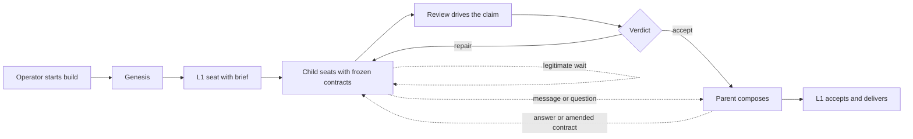

# Substrate Physics — one-sitting brief

**Status:** current implemented substrate, reconciled 2026-07-24. This brief explains the machinery
in the vocabulary of the build journey. It does not replace the detailed design specs or turn
proposed principles into ratified law. The L-1..L-5 laws and the six-service taxonomy in
`working-notes/SUBSTRATE-DERIVATION-2026-07-17.md` remain proposed for owner disposition.

The substrate has one job: let the behavior layer run faithfully without making behavioral
judgments of its own. It seats agents, carries their arrows, preserves the contracts they were
given, notices runtime failure, and moves only accepted work across a boundary.

## Daemon lifecycle

Genesis is the one deliberate start: it brings up the run-scoped daemon if absent, records the
build, reconciles any in-flight seats, opens L1, and attaches the operator to L1. While any build
seat is live, a per-run launchd job restarts a crashed daemon; the binding ledger and intent-first
run ledger make that restart a recovery, not a new build. When a completed sweep proves there is no
live build, the daemon may exit cleanly and remove its per-run protection. It is never a login-time
resident and never makes a product judgment.

## Gateway

Every seat enters through one gateway. The gateway claims the stable node address, checks that the
brief and frozen contracts exist, installs the runtime-specific hooks and credentials, applies the
seat's local-file reach, opens the pinned runtime, and records the actual seat before work begins.
Every later state change returns through the same single-writer gateway with owner-token,
generation, and lease fencing, so a stale or duplicated seat cannot act as the current owner. A
parent inside the jail asks for a child through its outbox; it never bypasses the gateway.

## Notary

The notary is the one freeze authority for intent, briefs and acceptance, accepted test packages,
and submitted review candidates. It stamps exact bytes, issues a receipt naming the holder and
version, and checks that the bytes still match. Confirmed intent becomes read-only at reflect-back;
accepted tests have one stable L4-owned home; a review candidate gets an immutable snapshot.
Changing a frozen contract requires its owner, the proper ratification channel, an immutable
revision record, and a new stamp. Holder receipts make every live dependency on the old version
computable. Receipt staleness is visible and wakes the holder today; whether it blocks anything is
an unresolved owner decision.

## Messages and questions

Every parent↔child arrow is one sender-owned direct-edge message pointing at a durable artifact.
The message record survives pane loss and sender respawn; the recipient inbox carries only a
recoverable pointer. `needs_answer` makes that same message an open question and makes the asker's
wait derivable from the ledger. The recipient answers with another message that names the question,
closing it atomically. Arbitration is a tag on such a question, not another protocol. Messages can
persuade, clarify, and ask; they cannot amend a frozen contract.

## Wake table

The daemon, not a sender or role prompt, decides whether an event wakes a seat. The table has no
per-message knobs: direct-edge messages, answers, amendment notices, gate verdicts, barrier
completion, plan-alignment decisions, and human answers wake; ordinary pre-barrier child-completion
rows do not. Delivery is verified against the current seat and retried from durable state when a
pane misses it. A missing keystroke costs latency, not the message, question, verdict, or amendment.

## Barriers

A parent should not turn once for every child finishing a cohort. Product children and review-check
children form separate address-owned cohorts. Their individual terminal rows append silently; the
cohort crosses a barrier only when it changes from at least one nonterminal member to none, and that
edge produces one wake. A newly opened member re-arms the cohort. Gate verdicts remain immediate
because they are decisions, not ordinary completion chatter. The dependency DAG still determines
what work may proceed; the barrier only controls when the waiting owner is interrupted.

## Turn state

Runtime hooks are the primary observation of a seat's turn. Claude reports turn running,
tool-in-flight, tool completion, and turn end; Codex's sanctioned notify surface reports turn end,
with its unavailable start/tool edges supplied by fallback evidence. At every observed turn end the
shared return-contract projection yields exactly one result: the owed product is present, the ledger
proves a legitimate wait, or the seat is reminded to produce what it owes or write an
explanation/question. The live owed checklist is installed at spawn and refreshed as obligations
land. Process death, a long-stuck tool, malformed/missing hooks, and hook-less runtimes retain the
pane/transcript/process evidence floor; that floor is fallback physics, not the normal judge of
agent progress.

## Jail

Every production seat runs inside the same external local-file policy. It may write only its owned
subtree; it may read its subtree, its parent and siblings' direct node surfaces, the exact launch
manifest and resolved references it was handed, and measured runtime essentials. L1's canonical
address carries the whole-tree read exception; a proposed optimizer exception is not implemented.
Observe mode applies the write/secret floor and records broad reads; enforce mode also refuses
out-of-graph local reads. Claude and Codex use the same policy seam. Internet access is deliberately
unchanged: this is local-file reach, not a network sandbox.

## Promotion

Agents build only inside the throwaway runtime tree. After the product has crossed its review
boundaries, L1 drives the recipient-visible result against the frozen intent and renders the
fidelity decision. Only an accepted fidelity decision lets the control plane promote the selected
product surface to the intake-captured destination; no agent writes around its jail to deliver it.
Promotion records the source, target, requester, acceptance reference, and outcome, and a failed
delivery stays an explicit retryable control-plane state rather than silently changing the frozen
intent.

## Why review cannot loop

Every review surface judges a **frozen candidate** (snapshotted at submission; drift fails the
gate closed) against a **surface frozen before the producer existed** — the acceptance package,
the plan, the intent-spec — so a reviewer can only bounce by citing a clause of a fixed contract,
never by moving a goalpost. On top of the anchor: findings are **typed**, the bounce loop is
**capped (3)** and then force-escalates, the producer holds an **arbitration** channel to the
shared parent, probe-style reviewers may block only on findings that cite a frozen surface
(everything else is filed inventory), and every bounce is a **loud audit event** that gets
studied. "The reviewer always finds something new" requires a moving target or an open-ended
charter; the system permits neither.

## What the owner sees

The durable ledger, messages, turn events, receipts, artifacts, snapshots, reports, and verdicts
support passive post-run inspection. `harnessctl view` now renders their join as terminal/JSON,
and `harnessctl journey` renders the large self-contained HTML/SVG journey DAG into harness control
space on read. The daemon aggregate relay is removed; no resident artifact competes with the joined
truth.
